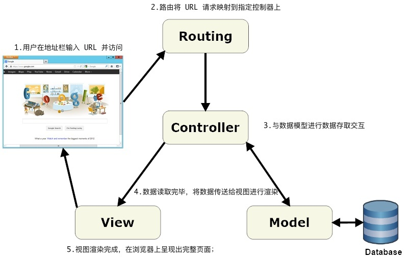

# Laravel 入门教程

### 第一章

**Composer**是[PHP](https://zh.wikipedia.org/wiki/PHP)的[软件包管理系统](https://zh.wikipedia.org/wiki/软件包管理系统)

### 第二章

如何在git仓库新增项目

如何部署Heroku

### 第三章

##### 3.2 创建应用

* 配置站点

  * wins的hosts文件

  * nginx的配置文件

    > cd /etc/nginx/sites-enabled/

* 配置开发环境
  * .env 文件

##### 3.3 静态页面

* 用户访问网页的过程
  1. 打开浏览器在地址栏输入 URL 并访问；
  2. 路由将 URL 请求映射到指定控制器上；
  3. 控制器收到请求，开始进行处理。如果视图需要动态数据进行渲染，则控制器会开始从模型中读取数据；
  4. 数据读取完毕，将数据传送给视图进行渲染；
  5. 视图渲染完成，在浏览器上呈现出完整页面；