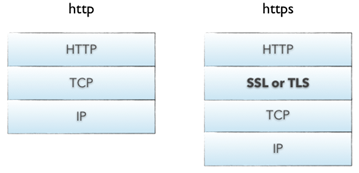

# 计算机网络

## 1.概述

#### 1. 计算机网络的概念

简单的来说，端系统相互通过通信链路和分组交换机连接形成计算机网络

#### 2. 一些重要的概念

* ###### 通信链路和分组交换机

  - 各种各样的物理媒体：同轴电缆，铜线，光纤，无线电频谱

  - 主要的分组交换机：路由器和链路层交换机

* ###### 分组交换和电路交换

  - 分组交换：时延可变且不可预测，但整体上性能更优
    - 什么是分组交换，为什么要使用分组交换？

  - 电路交换：能保持连接，但不管是时分复用还是频分复用，都因为预分配资源而可能浪费了时间
    - 直接打电话和微信电话的区别

* ###### 协议分层---五层协议模型

  * 应用层

    - 应用层是网络应用程序和应用层协议存留的地方

    - HTTP协议

    - SMTP协议

    - FTP协议

    - DNS域名系统

  * 传输层

    - 在应用程序端点之间传输应用层报文

    - TCP

    - UDP

    - 套接字

  * 网络层

    - 网络层负责将网络层分组从一个主机移动到另外一台主机

    - IP

  * 链路层

    - 将链路层帧从一个节点移动到另外一个节点

  * 物理层

    - 将链路层帧中的一个个比特从一个网络元素移动到临近的网络元素

* 网络安全
  * SSL
  * 使无线LAN安全
  * 防火墙和入侵检测系统

## 2.主要内容

### 1.http协议

* 基本结构

  * 请求
    * 请求行
      * 请求方法
      * Request-URI（get传参最大长度的限制是因为对URI长度的限制）
    * 消息报头
    * 请求正文

  * 响应
    * 状态行
      * 状态码
    * 消息报头
    * 响应正文

* 不同版本特性和优缺点比较

  * HTTP1.0

    - 特性
      - 无状态：服务器不跟踪不记录请求过的状态
      - 无连接：浏览器每次请求都需要建立tcp连接

    * 缺陷
      * 连接无法复用
      * 队头阻塞

  * HTTP1.1

    * 特性
      * 长连接
      * 管道
      * 缓存
      * 断点传输

    * 缺陷
      * 浏览器客户端在同一时间，针对同一域名下的请求有一定数量限制（为什么限制）

  * HTTP2.0
    * 特性
      * 二进制分帧
      * 多路复用
      * 头部压缩
      * 服务器推送

  * HTTPS
    * 实现原理
      * 
      * 加密算法
        * 对称加密
        * 非对称加密
        * 哈希算法
        * 数字签名

### 2.DNS域名系统

* 域名结构
  * 根域名服务器
  * 顶级域名服务器
  * 权限域名服务器
  * 本地域名服务器
* 域名解析过程
  * 递归查询
  * 迭代查询

### 3.UDP、TCP

* UDP和TCP区别
  * 有无连接
  * 对资源的需求
  * 流模式与数据报模式
  * 是否保证数据正确性和数据顺序
* TCP相关
  * TCP连接
    * 三次握手
    * SYN攻击
    * 四次挥手
  * TCP报文结构
    *  序号和确认号
    * 接收窗口
    * 首部长度
    * 标志字段
  * TCP滑动窗口协议
    * 滑动窗口
    * 拥塞窗口
  * TCP快速重传
  * TCP选择确认
    * GBN
    * SR
  * TCP拥塞控制
    * cwnd拥塞窗口和ssthresh慢启动阈值
    * 慢启动
    * 拥塞避免
    * 快速恢复

### 4.IP

* 数据平面
  * 数据转发
* 控制平面
  * 路由选择算法

### 5.web页面请求过程

