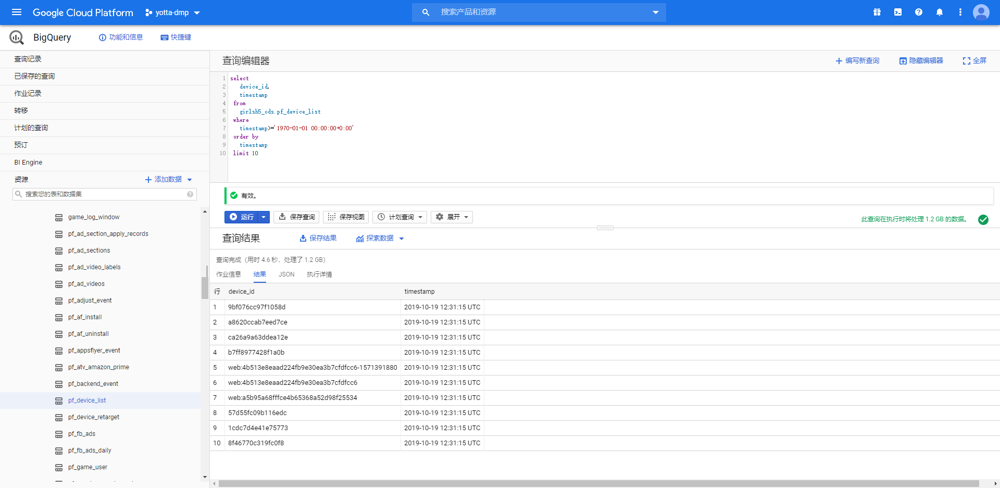
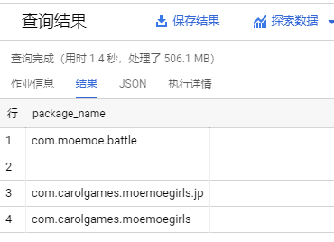

### 2020-07-21【新增sql】 学妹2根据包名查询对应充值金额

学妹2做一个sql，能根据包名查询对应充值金额。

学妹2上新unity包之后，能根据新旧包的包名，查询对应储值金额。

功能与目前储值管理-充值统计功能一样，多一个筛选包名的功能即可。

功能最晚上线截止时间在本周四。



```sql
找出使用超过两个包的玩家
SELECT
  device_id,
  COUNT(DISTINCT(package_name)) AS num
FROM
  girlsh5_ods.pf_device_list
WHERE
  timestamp>='1970-01-01 00:00:00+0:00'
GROUP BY
  device_id
HAVING
  num>=2
```

```sql
找出使用超过两个包的玩家的记录
SELECT
  device_id,
  package_name,
  MIN(timestamp)
FROM
  girlsh5_ods.pf_device_list
WHERE
  timestamp>='1970-01-01 00:00:00+0:00'
  AND device_id IN (
  SELECT
    device_id
  FROM
    girlsh5_ods.pf_device_list
  WHERE
    timestamp>='1970-01-01 00:00:00+0:00'
  GROUP BY
    device_id
  HAVING
    COUNT(DISTINCT(package_name))>=2)
GROUP BY
  device_id,
  package_name
```

```sql
找出现在正在使用新包的人数
SELECT
  device_id,
  package_name,
FROM
  girlsh5_pf.v_device_list
WHERE
  package_name='com.moemoe.battle'
  AND create_time>='2020-01-01 00:00:00+0:00'

```

讨论后的最终方案

> 基本背景情况描述：
>
> 学妹2在商店上线了Unity包，由于种种原因Unity包和原先的H5包在商店里是作为两个应用上架，但共用一套游戏后端，也可以通服。
>
> 
>
> 市场的主要需求：
>
> 将Unity包和H5包分成两个不同的应用，在eastblue查看每个不同应用的导量效果
>
> 
>
> 短期解决方案：
>
> 在市场相关的所有查看广告成效的功能中，加入针对campaign名称的筛选条件。市场方面会在投Unity包的广告中备注关键字，通过关键字搜索查看Unity包的导量情况
>
> 以及对订单表的channel字段进行优化，在玩家通过手机端进行付费的时候记录下当前付费的游戏包名，用来进行付费行为的归因
>
> 
>
> 长期解决方案：
>
> 通过合理的归因方式（目前未定）解决【玩家目前在玩哪个包】和【玩家在哪个包充值】，以及【怎样的广告带来了哪个包的玩家】这些问题，并且在市场的功能中进行区分展示。需要等unity包上线一段时间之后，结合玩家实际活跃和付费的情况再作考虑

```sql
查询v_device_list有多少种package_name
SELECT
  DISTINCT(package_name)
FROM
  girlsh5_pf.v_device_list
WHERE
  create_time>='1970-01-01 00:00:00+0:00'
```



发现有空值，查一下

```sql
select
	device_id,
	create_time,
	dedvice_type,
	advertising_id
from
	girlsh5_pf.v_device_list
where
	create_time>='1970-01-01 00:00:00+0:00'
	and (package_name='' or package_name is null)
```

五万五千条数据。。。

原因是：h5游戏有的玩家是在网页上玩的，所以没有包的概念

时间上限2020-07-21 21:00:00


目前bigquery还没有channel字段，需要更新bigquery

暂时先在MySQL上做查询，之后再移植到bigquery

```sql
select
	sum(pay_amount*exchange) as total_pay_dollar
from
	payment_29.pay_order
where
	channel=''
	and pay_time between '' and ''
	and get_payment=1
	
not in ('com.carolgames.moemoegirls','com.carolgames.moemoegirls','com.moemoe.battle')
```

```sql
--第一版结果
SELECT
  EXTRACT(date FROM pay_time) AS date_time,
  SUM(pay_dollar) AS total_pay_dollar
FROM
  girlsh5_pf.v_paid_order
WHERE
  [package_name]
  AND pay_time BETWEEN TIMESTAMP([time_range.0],[timezone])
  AND TIMESTAMP([time_range.1],[timezone])
  AND order_status != 'refund'     -- 注意订单状态
GROUP BY
  ROLLUP(date_time)
ORDER BY
  date_time
```

```sql
--第二版
SELECT
  EXTRACT(date
  FROM
    pay_time) AS date_time,
  SUM(pay_dollar) AS total_pay_dollar,
  COUNT(DISTINCT(player_id)) AS total_pay_players,
  COUNT(DISTINCT(id)) AS total_pay_orders,
  ROUND(SUM(pay_dollar)/COUNT(DISTINCT(player_id)),2) AS ARPPU
FROM
  girlsh5_pf.v_paid_order
WHERE
  [package_name]
  AND pay_time BETWEEN TIMESTAMP([time_range.0],[timezone])
  AND TIMESTAMP([time_range.1],[timezone])
  AND order_status != 'refund'
GROUP BY
  ROLLUP(date_time)
ORDER BY
  date_time
```

```sql
--线上版

SELECT
  EXTRACT(date
  FROM
    pay_time) AS date_time,
  SUM(pay_dollar) AS total_pay_dollar,
  COUNT(DISTINCT(player_id)) AS total_pay_players,
  COUNT(DISTINCT(id)) AS total_pay_orders,
  ROUND(SUM(pay_dollar)/COUNT(DISTINCT(player_id)),2) AS ARPPU
FROM
  girlsh5_pf.v_paid_order
WHERE
  [package_name]
  AND pay_time BETWEEN TIMESTAMP([time_range.0],[timezone])
  AND TIMESTAMP([time_range.1],[timezone])
  AND order_status != 'refund'
  AND attribute_lang in ([langs])
GROUP BY
  ROLLUP(date_time)
ORDER BY
  date_time
```

